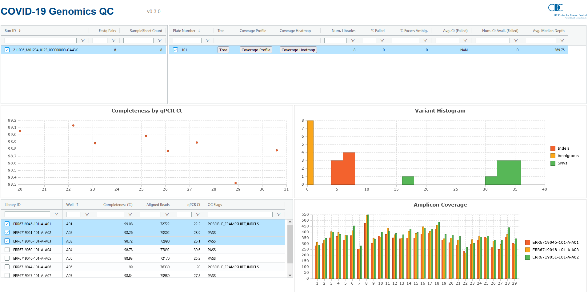

# BCCDC-PHL COVID QC Site

This site is used for routine review of quality control data related to SARS-CoV-2 sequencing and genomic analysis.



A live demo is available [here](https://bccdc-phl.github.io/covid-qc/). Note that sample identifiers (`ERR...`) correspond to the [NCBI SRA](https://www.ncbi.nlm.nih.gov/sra)
identifiers for the libraries that were used to generate the demo dataset.

## Development Setup

This site is written in [ClojureScript](https://clojurescript.org/), a dialect of [Clojure](https://clojure.org/) that compiles down to JavaScript. The ClojureScript compiler requires 

### Prerequisites - JDK, Clojure & NPM
JDK 8 or later. Follow [this guide](https://clojure.org/guides/getting_started) to installing clojure on your platform before starting development on this site.

The 'Node Package Manager' ([NPM](https://www.npmjs.com/)) is required for installing JavaScript dependencies. Follow [this guide](https://docs.npmjs.com/downloading-and-installing-node-js-and-npm) to install NPM on your platform.

After cloning this repository, run `npm install` from the top-level of the repo to install the JavaScript dependencies into the `node_modules` directory.

### Emacs - CIDER
[CIDER](https://cider.mx/) is a clojure(script) development environment for [Emacs](https://www.gnu.org/software/emacs/). To install CIDER, first add the [MELPA](https://melpa.org/#/getting-started) package archive to your Emacs installation. Then install CIDER as follows:

```
M-x package-install RET cider RET
```

Once CIDER has been installed, open the [src/covid_qc/core.cljs](src/covid_qc/core.cljs) file in Emacs. Then, start a CIDER REPL by running:

```
M-x cider-jack-in-cljs
```


A new CIDER REPL buffer will be created, resembling this:


### VS Code - Calva
[Calva](https://calva.io/) is a clojure(script) development environment for [VS Code](https://code.visualstudio.com/). Search for `calva` in the VS Code Extensions marketplace to install it.
